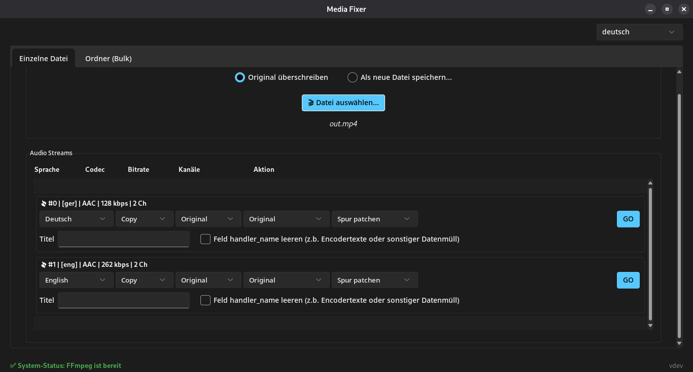
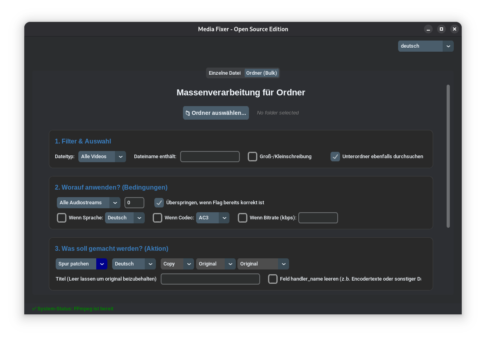
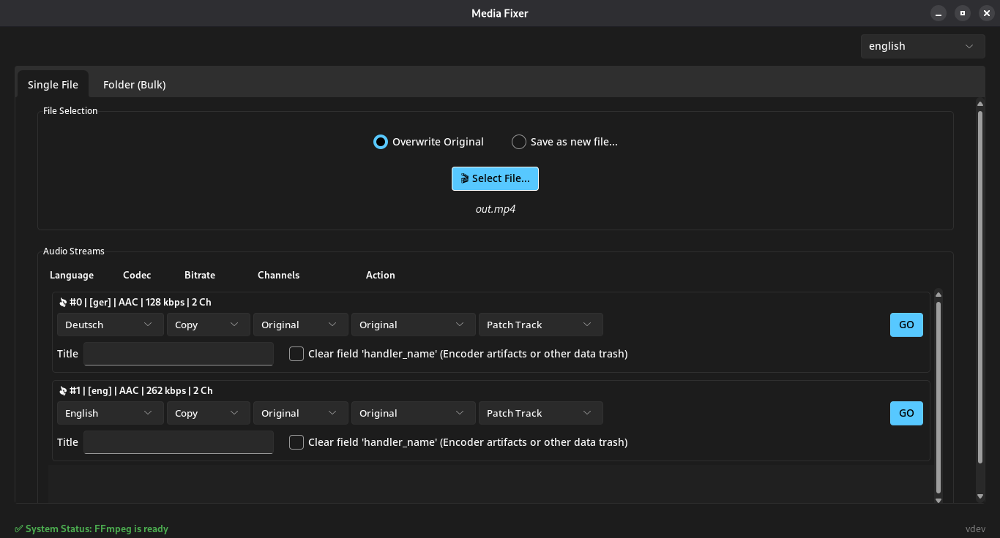
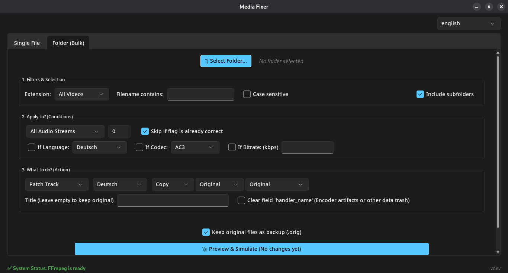

# 🎬 MediaFixer (Deutsch)

[English](README.md) | **Deutsch**

**MediaFixer** ist ein schlankes, konfigurationsfreies Desktop-Tool, um die Audiospuren der Videos deiner Mediensammlung aufzuräumen, bevor du sie deinem Server (wie Plex, Jellyfin oder Emby) hinzufügst.

Wenn du genervt bist von "Unbekannten" Tonspuren, inkompatiblen Audio-Codecs, die unnötiges Transcoding verursachen, oder kryptischen Track-Titeln, dann ist dieses Tool genau für dich gemacht.

## ✨ Hauptfunktionen

* **Massenverarbeitung (Bulk Patching):** Konvertiere alle Tonspuren aller Videos in einem Ordner in einen bestimmten Codec (z. B. AC3, AAC), ändere Bitraten oder erzwinge einen Stereo-Downmix für maximale Kompatibilität.
* **Sprach-Flags korrigieren:** Setze die richtigen Sprach-Tags (Deutsch, Englisch, etc.) für ganze Serien-Staffeln gleichzeitig, damit dein Player automatisch die richtige Spur für deine Videos wählt.
* **Metadaten-Bereinigung:** Benenne Track-Titel um oder lösche versteckten Datenmüll wie `handler_name` Tags, die oft von Encodern hinterlassen werden.
* **Sicherer Simulations-Modus:** Ruiniere niemals deine Bibliothek. MediaFixer bietet einen Simulationsmodus, der dir alle geplanten Änderungen zeigt, bevor auch nur ein Byte auf deiner Festplatte verändert wird.
* **Einfaches Setup:** Du musst keine Terminal-Befehle lernen oder FFmpeg manuell installieren. Der integrierte Setup-Assistent erledigt alles beim ersten Start automatisch.
* **Moderne Oberfläche:** Eine intuitive Dark-Mode Benutzeroberfläche (Rime Theme), die nativ Deutsch und Englisch unterstützt.

---

## 📸 Screenshots

| Einzeldatei-Inspektor (DE) | Massenverarbeitung (DE) |
|:---:|:---:|
|  |  |
| **Einzeldatei-Inspektor (EN)** | **Massenverarbeitung (EN)** |
|  |  |

---

## 🚀 Installation & Benutzung

### 🪟 Windows (Empfohlen)
1. Gehe zur [Releases-Seite](../../releases/latest).
2. Lade die aktuellste `MediaFixer-windows.zip` herunter.
3. Entpacke die ZIP-Datei in einen Ordner deiner Wahl.
4. Starte die `MediaFixer-windows.exe`.
5. *Hinweis: Beim ersten Start lädt der Setup-Assistent automatisch die benötigten FFmpeg-Dateien in den Ordner.*

### 🐧 Linux
1. Gehe zur [Releases-Seite](../../releases/latest).
2. Lade die `MediaFixer-linux` Datei herunter.
3. Öffne dein Terminal und vergib die Ausführungsrechte:

       chmod +x MediaFixer-linux

4. Starte die Anwendung:

       ./MediaFixer-linux

5. *Hinweis: Bitte stelle sicher, dass `ffmpeg` auf deinem System installiert ist (z. B. `sudo apt install ffmpeg`).*

---

## 🛠 Für Entwickler (Ausführen aus dem Quellcode)

Du möchtest den Code anpassen oder selbst bauen? Kein Problem!

1. Klone das Repository:

       git clone https://github.com/sirbenris/MediaFixer.git
       cd MediaFixer

2. Erstelle und aktiviere eine virtuelle Umgebung (VENV):

       python -m venv .venv
       source .venv/bin/activate  # Unter Linux
       .\.venv\Scripts\activate   # Unter Windows

3. Installiere die benötigten Abhängigkeiten:

       pip install sv_ttk pymediainfo

4. Starte die App:

       python main.py

---

## 🛡️ Wichtige Hinweise & Rechtliches

### Antiviren-Warnungen (Windows)
Da diese Anwendung mit `PyInstaller` erstellt wurde und nicht digital mit einem teuren Firmen-Zertifikat signiert ist, könnten Windows Defender oder dein Browser die Datei als "unbekannt" oder potenziell unsicher markieren. **Dies ist eine bekannte, falsche Warnung (False Positive), die bei fast allen Python-basierten Programmen auftritt.** Du kannst sicher auf *Weitere Informationen -> Trotzdem ausführen* klicken. Der gesamte Quellcode ist hier zur Überprüfung offen einsehbar.

### Drittanbieter-Lizenzen
* **FFmpeg:** Diese Software nutzt Code von [FFmpeg](http://ffmpeg.org), lizenziert unter der LGPLv2.1.
* **MediaInfo:** Dieses Tool verwendet `pymediainfo` und die `MediaInfo`-Bibliothek (BSD-2-Clause Lizenz) für die Metadaten-Extraktion.

### Haftungsausschluss
*Dieses Tool verändert Mediendateien. Obwohl es Backups und einen Simulationsmodus bietet, wird die Software ohne jegliche Gewährleistung zur Verfügung gestellt. Erstelle immer Backups deiner wichtigen Dateien, bevor du Massenoperationen durchführst.*